# ⚡ EcoCharger

<div align="center">

### 🌱 Smart • Sustainable • Renewable EV Charging Platform

A cross-platform mobile application built with **React Native** that helps Electric Vehicle (EV) users locate nearby charging stations, reserve charging slots, monitor charging sessions, and promote sustainable transportation through renewable energy integration.


</div>

---

# 📸 Preview

<p align="center">
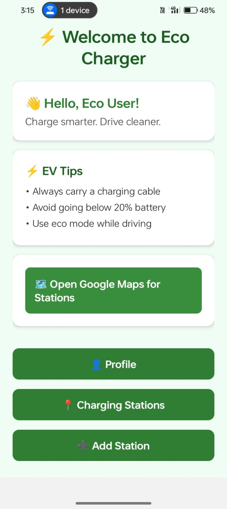
</p>

---

# 📑 Table of Contents

- About
- Problem Statement
- Solution
- Features
- Tech Stack
- Project Structure
- Installation
- Screenshots
- Future Enhancements
- Author

---

# 🌍 About

EcoCharger is a smart EV charging application that enables users to discover eco-friendly charging stations powered by renewable energy sources.

The application simplifies EV charging by providing real-time station availability, advance slot booking, navigation support, charging history, secure authentication, and sustainability tracking.

The primary goal of EcoCharger is to encourage clean energy adoption while improving the charging experience for EV owners.

---

# 🚨 Problem Statement

Electric Vehicle users often face several challenges:

- Difficulty locating nearby charging stations
- No real-time charging station availability
- Long waiting times
- Lack of reservation systems
- Poor user interfaces
- Limited renewable-energy charging information
- No sustainability tracking

---

# 💡 Proposed Solution

EcoCharger solves these problems by providing:

- 📍 Nearby charging station locator
- ⚡ Live charging station availability
- 📅 Advance slot booking
- 🗺️ Google Maps navigation
- 🔋 Charging session monitoring
- 🌱 Carbon footprint tracking
- 🔐 Secure authentication
- 💳 Digital payment integration

---

# ✨ Features

### 🌞 Renewable Energy

- Solar-powered charging stations
- Wind-powered charging stations
- Green energy support

### 📍 Station Finder

- Nearby charging stations
- Google Maps integration
- Live location

### ⚡ Live Availability

- Available stations
- Occupied stations
- Real-time updates

### 📅 Smart Booking

- Reserve charging slots
- Booking history
- Cancel reservations

### 🔋 Smart Charging

- Energy monitoring
- Charging statistics
- Dynamic pricing

### 🔐 Authentication

- Login
- Signup
- Secure user management

### 💳 Payments

- Secure payment
- Booking invoices
- Payment history

### 🌱 Sustainability

- Carbon savings
- Eco Points
- Green energy statistics

---

# 🛠 Tech Stack

## Frontend

- React Native
- Expo
- JavaScript
- React Navigation
- AsyncStorage
- Fetch API

## Backend

- Firebase Authentication
- Firebase Firestore
- Firebase Storage

## APIs

- Google Maps API
- Geolocation API

## Tools

- VS Code
- Android Studio
- Git
- GitHub

---

# 📂 Project Structure

```
EcoCharger
│
├── assets
├── components
├── navigation
├── screens
├── services
├── firebase
├── utils
├── screenshots
├── App.js
├── package.json
└── README.md
```

---

# 🚀 Installation

Clone the repository

```bash
git clone https://github.com/your-username/EcoCharger.git
```

Navigate into the project

```bash
cd EcoCharger
```

Install dependencies

```bash
npm install
```

Start Expo

```bash
npm start
```

Run Android

```bash
npm run android
```

Run iOS

```bash
npm run ios
```

---

# 📱 Application Screenshots

## Splash Screen

<p align="center">
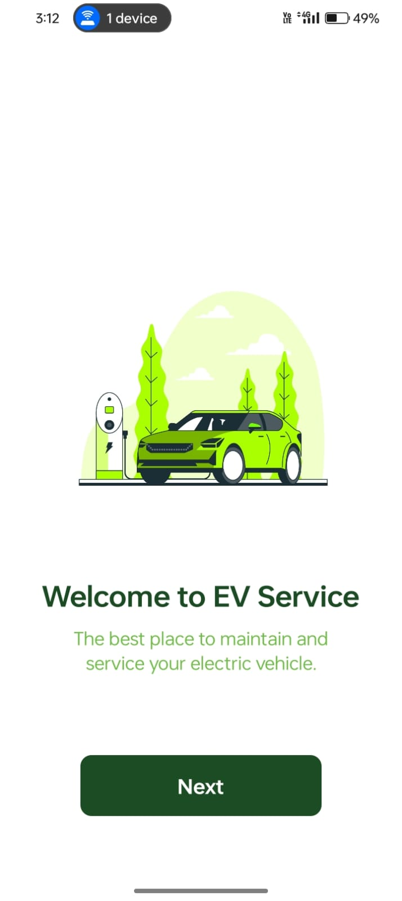
</p>
<p align="center">
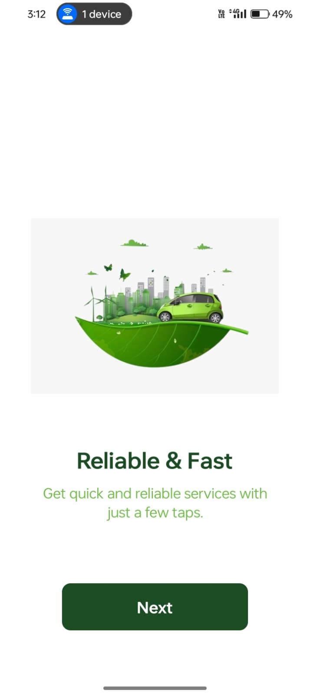
</p>
<p align="center">
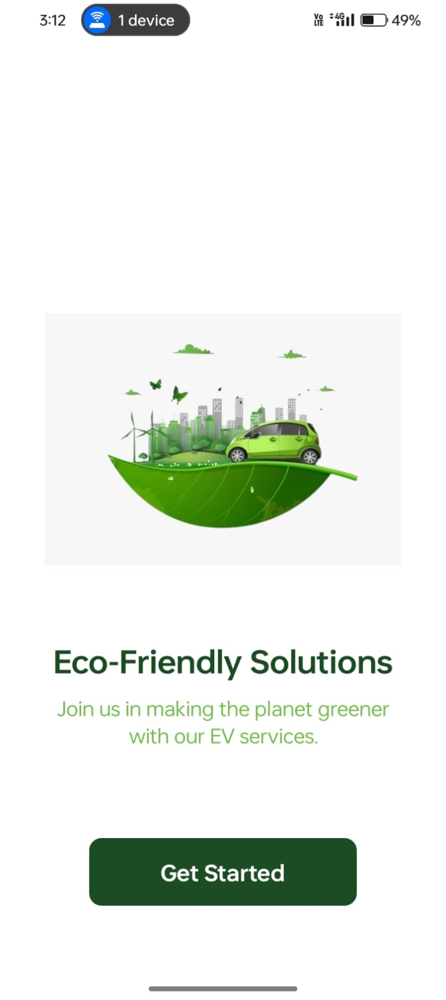
</p>

---

## Login Screen

<p align="center">
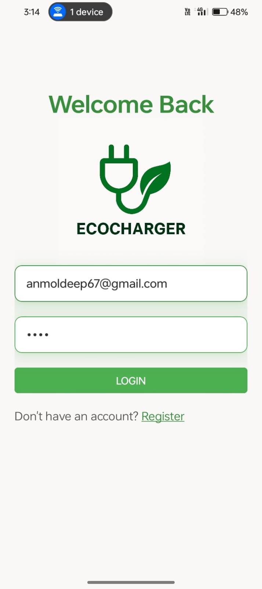
</p>

---

## Signup Screen

<p align="center">
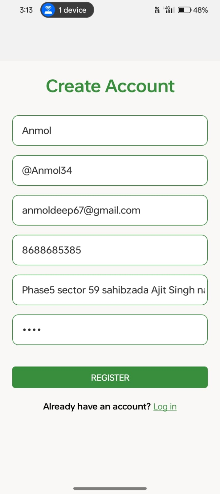
</p>
<p align="center">
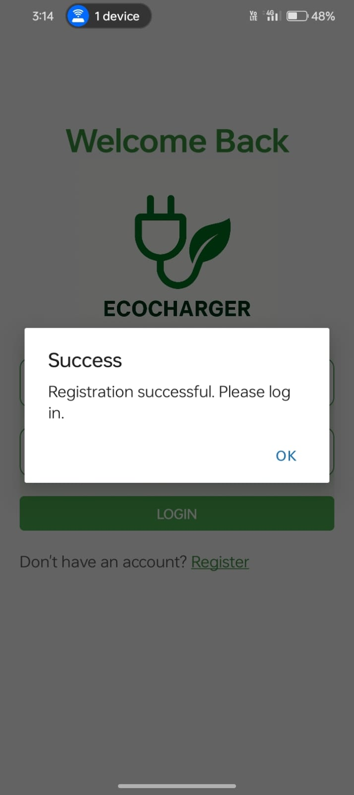
</p>

---

## Home Screen

<p align="center">

</p>

---

## Tips Screen

<p align="center">
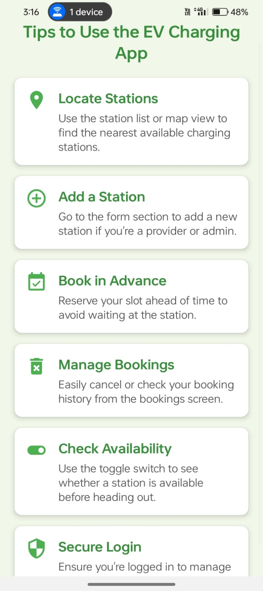
</p>

---

## Charging Station List

<p align="center">
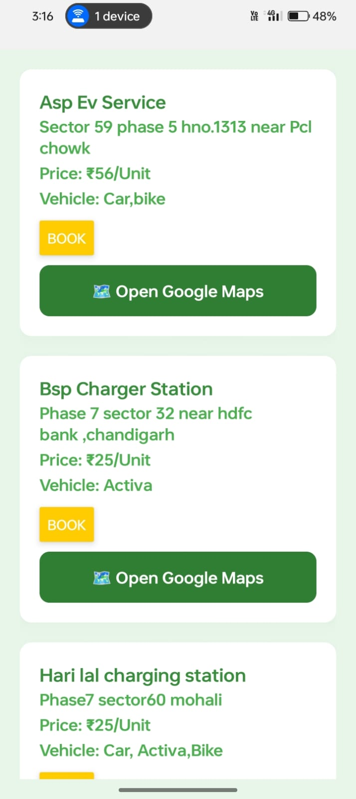
</p>

---

## Charging Station Details

<p align="center">
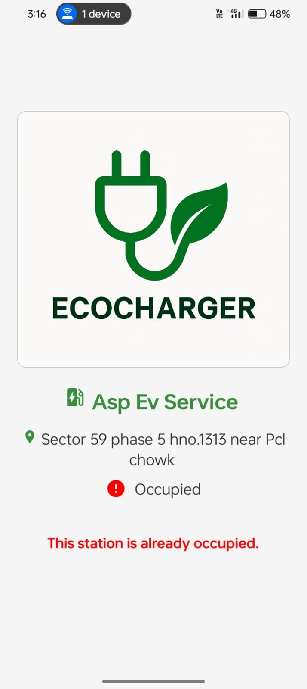
</p>
---

## Add Charging Station

<p align="center">
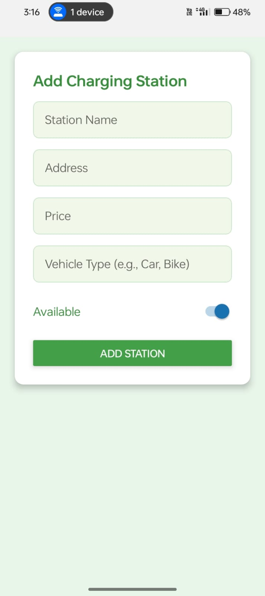
</p>

---

## User Profile

<p align="center">
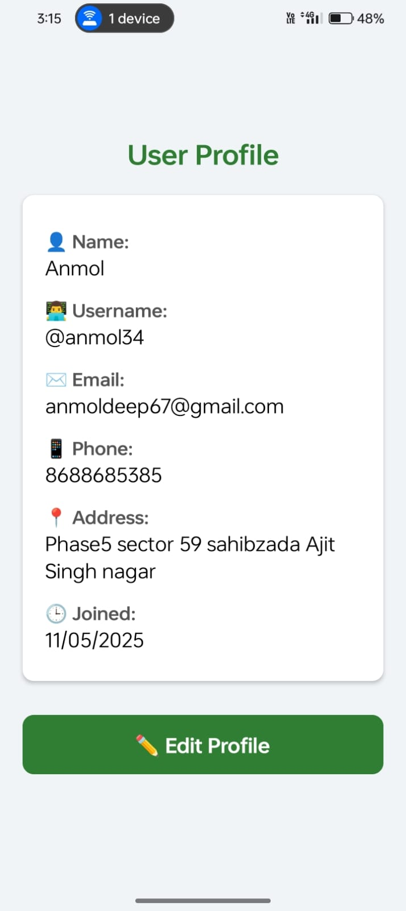
</p>
<p align="center">
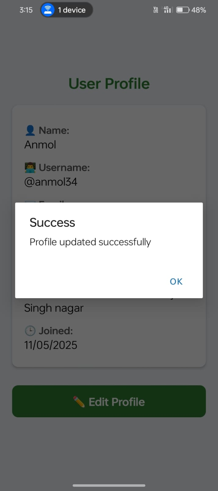
</p>

---

# 🎯 Future Enhancements

- 🤖 AI-powered charging station recommendations
- 🚗 Vehicle battery health monitoring
- 🔔 Push notifications
- 📷 QR Code-based charging
- 🌍 Offline maps
- ☀ Solar energy analytics
- 📈 Smart charging prediction
- 🎁 Eco rewards system
- 👨‍💼 Admin dashboard
- 📊 Advanced analytics

---

# 👨‍💻 Author

## Suman Mouriya

**MCA Student**  
**React Native Developer**

Passionate about building scalable mobile applications and sustainable technology solutions.

---

# ⭐ Support

If you found this project helpful:

⭐ Star this repository

🍴 Fork this repository

💡 Contribute to improve EcoCharger

🐞 Report bugs and suggest new features

---

<div align="center">

## 🌱 Building a Greener Future, One Charge at a Time ⚡

Made with ❤️ using React Native & Firebase

</div>
